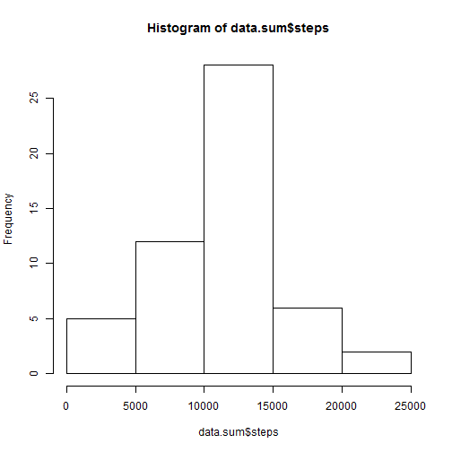
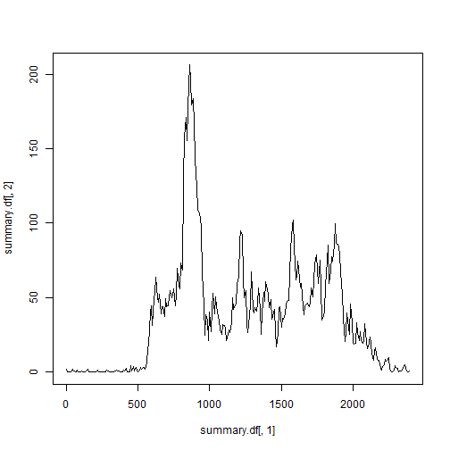
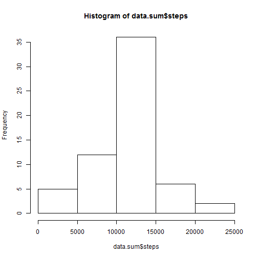

##Part 1 - Loading and pre-processing data
This section of code is responsible for reading in the raw data. No pre-processing was required.

```r
#read in raw data excluding any NAs
raw.data <- read.csv("activity.csv")
```

##Part 2 - Mean total number of steps taken per day
This section conducts the necessary analysis to answer the question what is the mean total number of steps per day. 

To begin with NAS were omitted and the date aggregated by date.

```r
#creates data.frame containign all non NA entries
data.without.nas <- na.omit(raw.data)

#creates an aggregation (usin sum) 
data.sum <- aggregate(x=data.without.nas[c("steps")],FUN=sum,by=list(Group.date = data.without.nas$date))
```
The data was then plotted as a histogram.

```r
hist(data.sum$steps)
```

 
Finally the mean and median were calculated.

```r
#aggretgates the data by date

answer.mean <-mean(data.sum$steps)
print(append("Mean: ",answer.mean))
```

```
## [1] "Mean: "           "10766.1886792453"
```

```r
answer.median <-median(data.sum$steps)
print(append("Median: ",answer.median))
```

```
## [1] "Median: " "10765"
```
The final answers were: mean 10766.19 and median 10765.


##Part 3 - Average daily activity pattern
This section works though the necessay analysis to determine the average activity pattern.

```r
#aggretgates the data by date

  summary.df <- data.frame(interval=numeric(),steps=numeric())

  vals<-unique(unlist(data.without.nas$interval,use.names=FALSE))
  max.steps<-0
  answer.interval<-0
  count <-length(vals)
  i <-  1
  while (i<=count)
  {
    current.val <- vals[i]
    final.val <- 100*(100*(current.val/100-trunc(current.val/100))/60 
                + trunc(current.val/100))
    avg <- mean(subset(data.without.nas,interval == current.val)$steps)
    summary.df<- rbind(summary.df,c(final.val,avg))
    i <- i + 1
    
    if (avg>max.steps) 
    {
      max.steps<-avg
      answer.interval<-current.val
    }
  } # end whilecall

  colnames(summary.df) <-c("interval","steps")
```


Plots the time series.

```r
  plot(summary.df[,1],summary.df[,2],type="l")
```

 

Answers the question which 5 minute interval on average across all days contains the maximum number of students.

```r
    print(answer.interval)
```

```
## [1] 835
```

##Part 4 - Inputting missing values


```r
 raw.data <- read.csv("activity.csv")
  raw.data.without.nas <- na.omit(raw.data)
    
  print(nrow(raw.data))
```

```
## [1] 17568
```

```r
  print(nrow(raw.data.without.nas))
```

```
## [1] 15264
```

```r
  i <- 1
  
  while (i <= nrow(raw.data))
  {
    
    if(is.na(raw.data[i,1]))
    {
     current.interval <- raw.data[i,3]
      
    #  print(current.interval)
      avg <- mean(subset(raw.data.without.nas,interval == current.interval)$steps)
     
      raw.data[i,1] <-avg
    
    #  print(avg)
            
    } # end if
      
      i <- i+1
      
      
  } # end while
  
  data.sum <- aggregate(x=raw.data[c("steps")],FUN=sum,by=list(Group.date = raw.data$date))
  
  hist(data.sum$steps)
```

 
